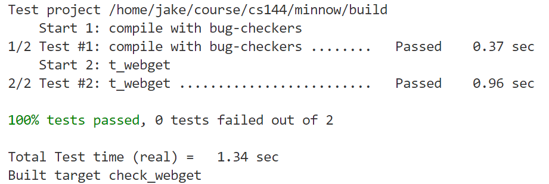
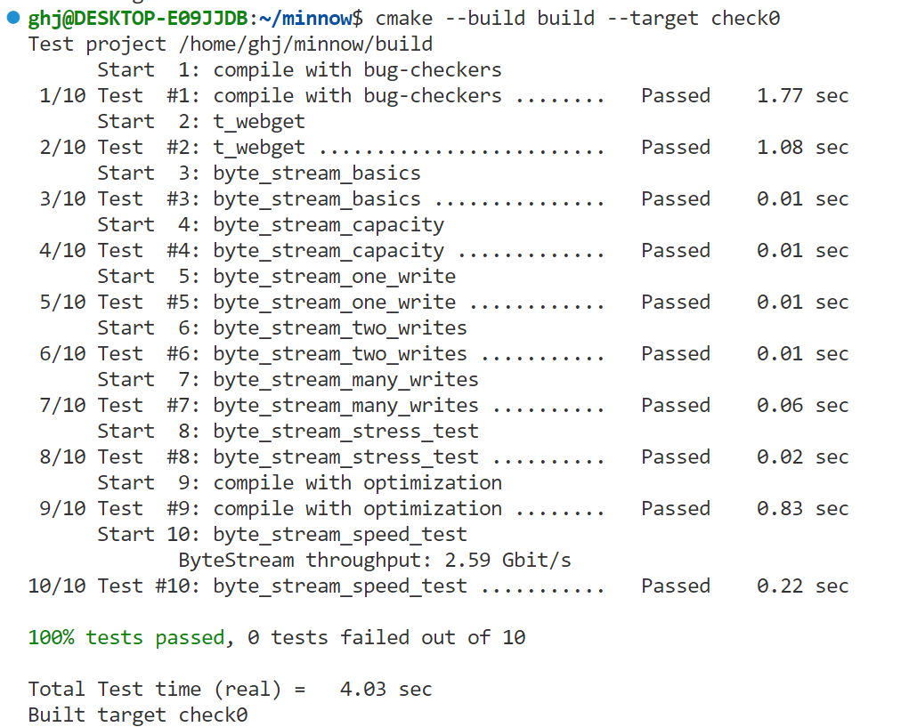

### 3 Writing a network program using an OS stream socket
**实现webget**

```cpp
TCPSocket tcp;
  tcp.connect(Address(host, "http"));
  tcp.write(
        "GET "   + path + " HTTP/1.1\r\n" +
        "Host: " + host + "\r\n" +
        "Connection: close\r\n\r\n"
    );
  string str;
  while(!tcp.eof()) {
    tcp.read(str);
    cout << str;
  }
  tcp.close();
```

**实验结果**



### 4 An in-memory reliable byte stream

首先需要在byte\_stream.hh 为ByteStream 定义一些必须的状态变量，用**std::string**模拟，buffer。
之后就是对这段内存进行写入读出，写入的时候更新**pushed_len_** ，读出的时候更新**popped_len_**。
实验结果如下：



